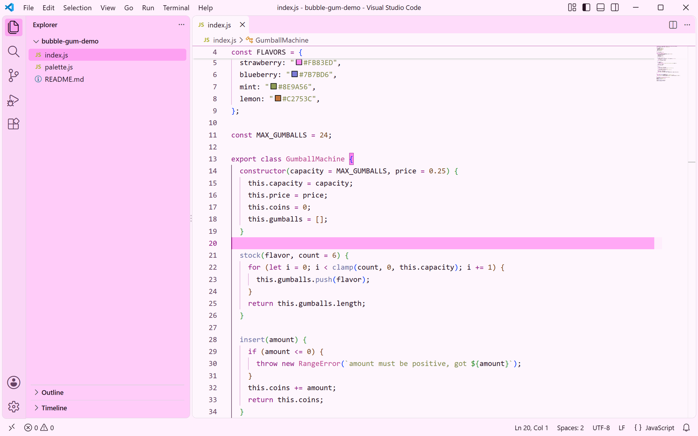
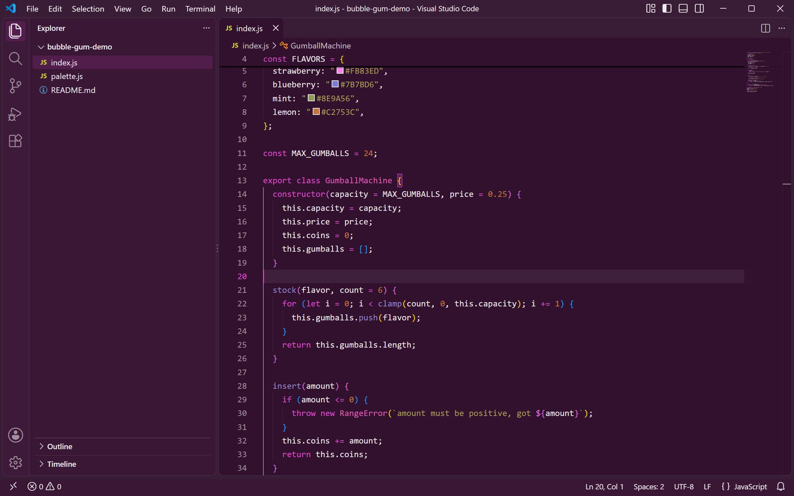

<h1 align="center">Bubble Gum Theme</h1>

<p align="center">
  A playful pastel VS Code theme built on bubble gum pink and sugar magenta, with light and dark variants.
</p>

<p align="center">
  <a href="https://marketplace.visualstudio.com/items?itemName=lilinhuang.bubble-gum-theme">
    
  </a>
  <a href="https://github.com/vaxicy/bubble-gum-theme/blob/main/LICENSE">
    
  </a>
</p>

## Previews

<p align="center">
  
  
</p>

Left is the light variant, right is the dark variant. Both were captured in
Visual Studio Code with the extension installed, using the same JavaScript file
and the same window layout.

## Introduction

Bubble Gum Theme is a sweet, high-spirited color theme for Visual Studio Code.
It keeps the surfaces soft and the accents loud: a marshmallow canvas, candy
pink panels, and a magenta that carries keywords, tags and links without ever
shouting.

The extension ships two selectable variants from one visual family:

- **Bubble Gum Theme Light** — a barely-there blush canvas (`#FEF6FD`) with deep plum text and magenta accents.
- **Bubble Gum Theme Dark** — a dark berry canvas (`#32112E`) with cream text and brighter bubble gum accents.

## Palette

| Role | Light | Dark | Name |
| --- | --- | --- | --- |
| Editor canvas | `#FEF6FD` | `#32112E` | marshmallow |
| Side bar | `#FFCCF9` | `#391735` | bubble gum |
| Tabs / panels | `#FEDCFA` | `#391C35` | sugar wrap |
| Selection | `#FB83ED` | `#61215A` | candy pink |
| Accent | `#951E88` | `#DB4BCB` | magenta |
| Foreground | `#271223` | `#F1E9F0` | plum / cream |

## Syntax

Comments stay quiet and italic (`#674364` / `#A18E9F`), keywords, tags and
headings carry the magenta accent, functions sit in a soft indigo, strings use
a muted olive, numbers a warm caramel brown, and types and classes a bright
raspberry pink. Semantic highlighting is enabled, so TypeScript, JavaScript and
Python pick up accurate class, interface, enum, function, method, parameter,
property and variable colors on top of the TextMate rules.

## Installation

1. Open the Extensions view (`Ctrl+Shift+X` / `Cmd+Shift+X`).
2. Search for `Bubble Gum Theme`.
3. Click **Install**.

Or install from the command line:

```
code --install-extension lilinhuang.bubble-gum-theme
```

## Usage

1. Open the Command Palette (`Ctrl+Shift+P` / `Cmd+Shift+P`).
2. Run **Preferences: Color Theme** (or `Ctrl+K Ctrl+T`).
3. Pick **Bubble Gum Theme Light** or **Bubble Gum Theme Dark**.

## Notes

- Both variants theme the whole workbench, not only the editor: activity bar,
  side bar, tabs, panels, terminal, command palette, lists, inputs, badges,
  notifications, diffs and Git decorations.
- The README previews come from real VS Code windows captured with the
  extension installed, so what you see is what the theme renders.

## Feedback

Suggestions and issues are welcome — please open an issue or pull request on
the project repository.

## License

MIT — see [LICENSE](LICENSE).
